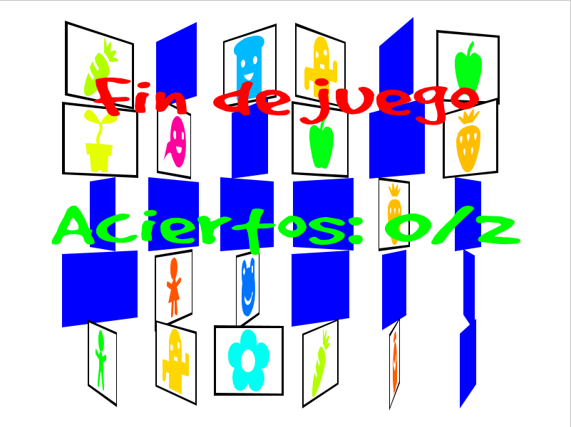
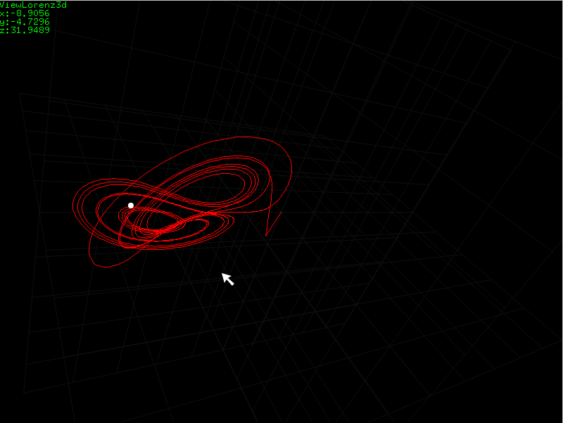
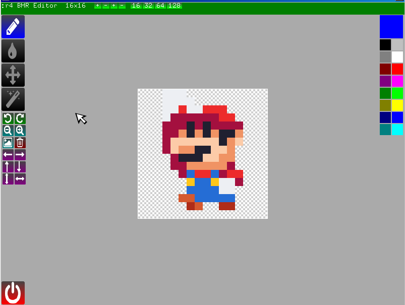
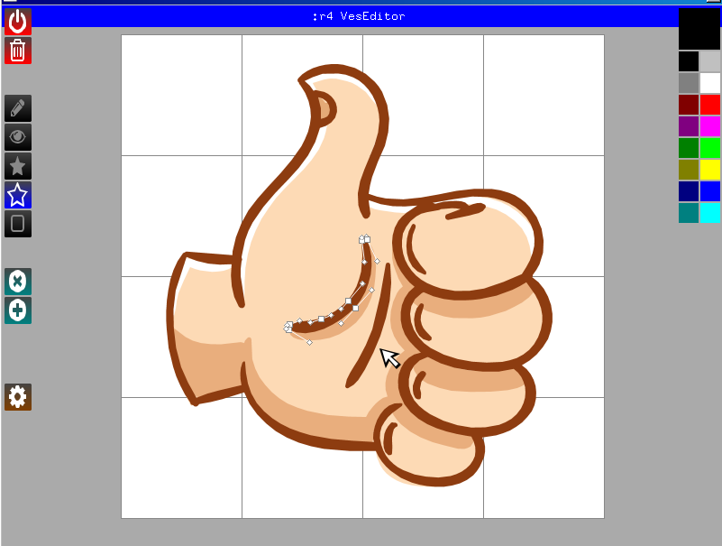
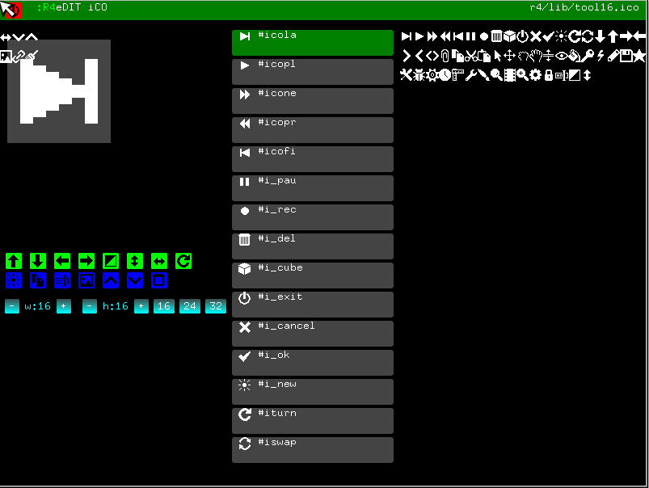
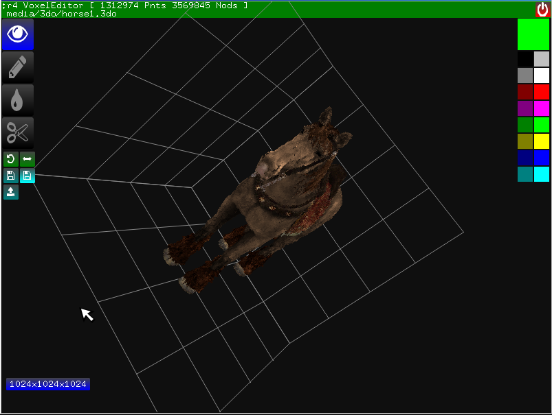

# :r4

Computer Programming Language based on ColorForth ideas

Started in 2005 along with my study of the Forth language.

:r4 is a Forth but simpler although not less powerful.

## some screenshots

 

The main menu, but all is make in r4, this can be other or start the app.

 

The editor and the debuger, a compiler can generate a standalone exacutable.

 

Many game and examples, in continuos growing.

 
 
 
 

Some editors, with original file format, can import from many sources and generate the code inside the exe


## Quick overview

The behavior of the language is guided by prefixes :

* : prefix to define code
* \# prefix to define data
* ^ prefix to include definitions from other source files
* ' prefix to get the adress of code or data
* | prefix for comments (until the end of the line)
* " prefix to define strings, which end with another "
* $ hex numbers
* % binary number
* : alone is the starting point of the program

example
```
#x 2
#y 3

:cuad | a -- a^2 
  dup * ;  
  
:dist | -- d^2   distance to x y
  x cuad y cuad + ;

: dist ;
```  

The conditionals:<br/>
0?, 1?, +?, -? are simple conditionals, they test but do not destroy the top of stack (TOS), 0? tests if the TOS=0.. and so on.<br/>
=?, <? .. and? .. are conditionals that compare two values, they destroy the TOS.

Flow control is different than other forths, there are built in, with blocks of code construction.
```
?? ( .. ) are IF
?? ( .. )( .. ) are IF-ELSE
( ..?? )( .. ) are WHILE
( ..?? ) are UNTIL
```

example
```
:countdown
  10 ( 1? )( 1-     | while TOS are diferent from 0
    dup "%d" print cr
    ) drop ;
    
```  

# Actual development

This version is a bytecode interpreter for the WINE, WINCE and ANDROID platforms.

* forth-like language to program computers.
* uses prefixes to guide compiler behavior, like Colorforth but without colors..a colorless colorforth.
* has a VM, editor, games, programming samples.
* has a compiler for the FASM assembler which can make standalone .exe

- Only can generate win exec, waiting for a smart coder for lin,mac etc.

# More info

* e-mail: pabloreda@gmail.com
* download: https://drive.google.com/open?id=0Bz3UnwydnNGhQmlOSGRwaXJmX3c
* tool to compile the r4VM: https://drive.google.com/drive/folders/0Bz3UnwydnNGhRl9RSElYbkZhUU0
* videos: http://www.youtube.com/user/pablohreda
* group: http://groups.google.com/group/reda4
* twitch: https://www.twitch.tv/phreda4
