# :r4

Computer Programming Language based on ColorForth ideas

Started in 2005 along with my study of the Forth language.

:r4 is a Forth but simpler although not less powerful.

r4.exe is a fort virtual machine, with a bytecode compiler and a bytecode interpreter (very very fast).

One apps is a compiler, this generate asm for x86 in FASM syntax, see in r4asm folder.
You can code in any editor, put the .txt file in r4/ folder and this is show in main,

## some screenshots

 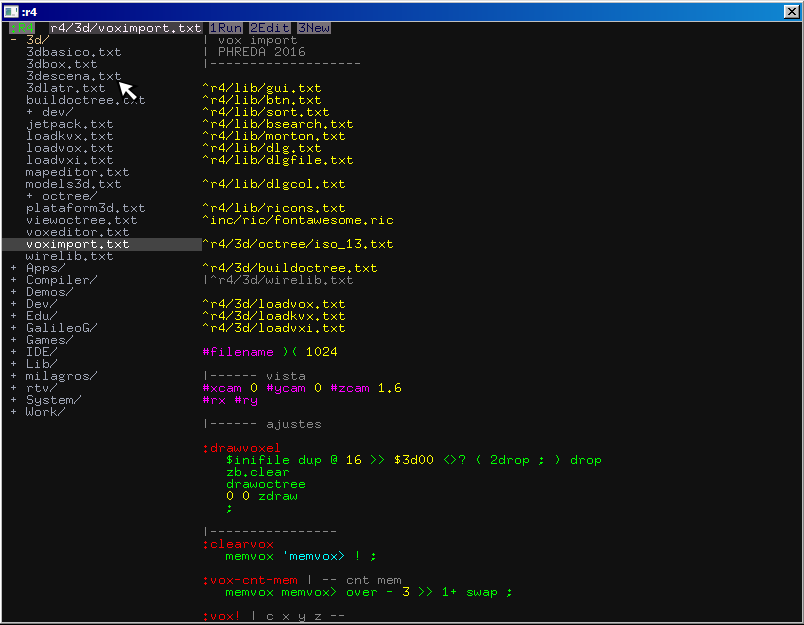

The main menu, all is make in r4, this can be other source or start the any app.
hit f1 to exec, when you have bugs, some help in internal editor (made in r4 too) show this or the app crash.
hit f2 to edit

 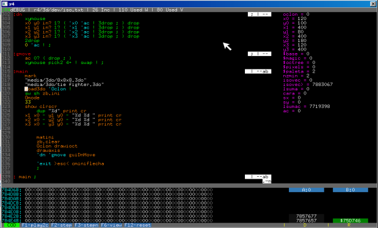

The debuger, with step by step play, memory dump, variable dump and stack view.
in the internal editor hit f2 and run in debugger.
There are a simple profiler with f3 key in editor and a simple compiler with f5 key.
The big optimice compiler are in developing (version 4), hit f10 in editor ans see the compiler folder

hit ctrl-E in internal editor in the include word, the extension call the apropiate editor.
.ico for icons

 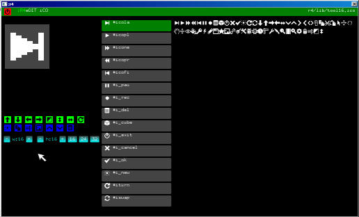

.bmr for bitmaps

 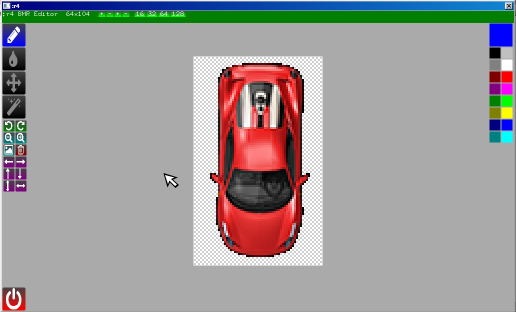

.vsp for vector graphics

 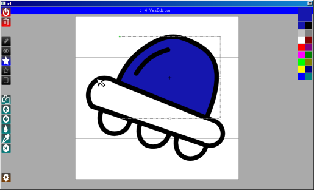

Some games and demos

 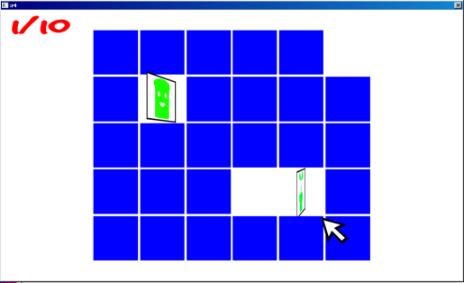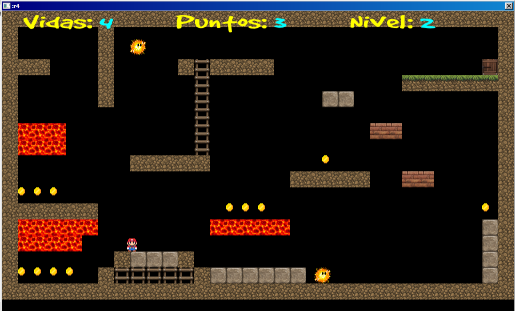
 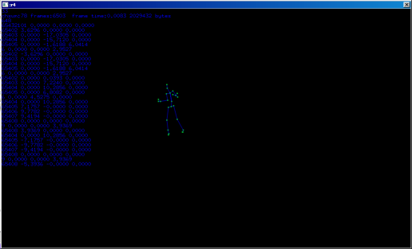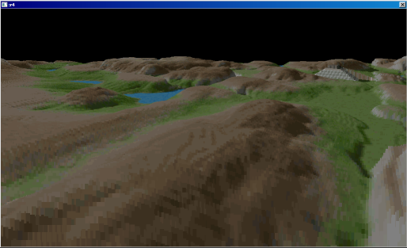
 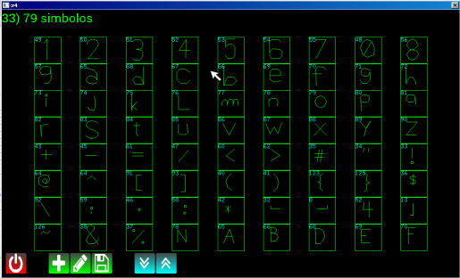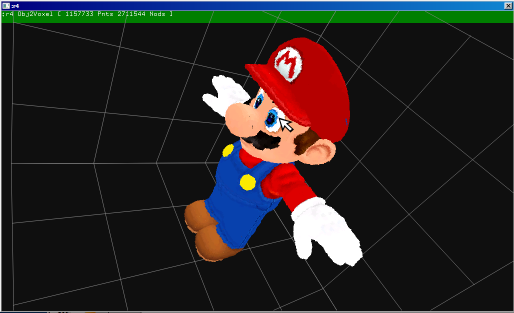
 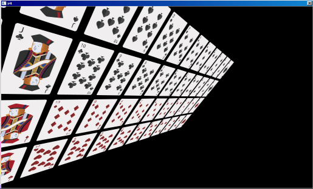

## Quick overview

First, learn stack manipulation, every forth lang use this, use "Starting forth" or "Thinking forth".
Only stack manipulation, ColorForth and r4 avoid some forth construction.

In r4 there are two definitions things #DATA and :CODE

The behavior of the language is guided by prefixes :

```
 : prefix to define code
 # prefix to define data
 ^ prefix to include definitions from other source files
 ' prefix to get the adress of code or data
 | prefix for comments (until the end of the line)
 " prefix to define strings, which end with another "
 $ hex numbers
 % binary number
 : alone is the starting point of the program
```

example
```
#x 2
#y 3

:cuad | a -- a^2
  dup * ;

:dist | -- d^2   distance to x y
  x cuad y cuad + ;

: dist ;
```

Flow control is different than other forths, there are built in, with blocks of code construction.
```
?? ( .. )	are IF
?? ( .. )( .. )	are IF-ELSE
( ..?? )( .. )	are WHILE
( ..?? )	are UNTIL
```

The conditionals:<br/>

simple conditionals, they test but do not destroy the top of stack (TOS)
```
0? 	| --		is TopOfStack 0?
+? 	| --		is TOS positive ?
-?	| --		is TOS negative ?
1? 	| --		is TOS not 0?
```

Double conditionals that compare two values, they destroy the TOS.
```
=?	| a b -- a	a = b ?
<?	| a b -- a	a < b ?
>?	| a b -- a	a > b ?
<=?	| a b -- a	a <= b ?
>=?	| a b -- a	a >= b ?
<>?	| a b -- a	a <> b ?
AND?	| a b -- a	a and b ?
NAND?	| a b -- a	a nand b ?
```

example
```
:countdown
  10 ( 1? )( 1-     | while TOS are diferent from 0
    dup "%d" print cr
    ) drop ;

```

Data stack manipulation
```
DUP 	| a -- a a
DROP 	| a --
OVER 	| a b -- a b a
PICK2 	| a b c -- a b c a
PICK3 	| a b c d -- a b c d a
PICK4 	| a b c d e -- a b c d e a
SWAP 	| a b -- b a
NIP	| a b -- b
ROT 	| a b c -- b c a
2DUP 	| a b -- a b a b
2DROP   | a b --
3DROP   | a b c --
4DROP   | a b c d --
2OVER	| a b c d -- a b c d a b
2SWAP	| a b c d -- c d a b
```

Return stack manipulation
```
>R 	| a --      R: -- a
R> 	| -- a		R: a --
R@	| -- a      R: a -- a
```

Logic
```
AND 	| a b -- c     c = a AND b
OR 	| a b -- c     c = a OR b
XOR 	| a b -- c     c = a XOR b
NOT  	| a b -- c     c = a NOT b
```

Arithmetic
```
+ 	| a b -- c	c=a+b
- 	| a b -- c	c=a-b
* 	| a b -- c	c=a*b
/ 	| a b -- c	c=a/b
*/ 	| a b c -- d	d=a*b/c, not bit lost,64 bits
*>>	| a b c -- d	d=(a*b)>>c, not bit lost,64 bits
<</	| a b c -- d	d(a<<c)/b,not bit lost,64 bits
/MOD 	| a b -- c d	c=a/b  d=a mod b
MOD 	| a b -- c	c=a mod b
ABS	| a -- b	b=|a|
NEG 	| a -- b	b=-a
CLZ	| a -- b	count leanding zeros
SQRT	| a -- b	square root
1+ 	| a -- b	b=a+1
4+	| a -- b	b=a+4
1- 	| a -- b	b=a-1
2/ 	| a -- b	b=a/2
2* 	| a -- b	b=a*2
<< 	| a b -- c	c=a<<b
>> 	| a b -- c	b=a>>b (sign)
0>>	| a b -- c	b=a0>>b (zero)
```

Access to Data Memory, the power of abstraction is here
```
@ 	| a -- b	b=32(a)
C@ 	| a -- b	b=8 (a)
W@	| a -- b	b=16(a)
!	| v d --	32(d) = v
C!	| v d --	8(d) = v
W! 	| v d --	16(d) = v
+! 	| v d --	32(d)=32(d)+v
C+!	| v d --	8(d)=8(d)+v
W+!	| v d --	16(d)=16(d)+v
@+	| d -- d+4	dword
!+	| v d -- d+4
C@+	| d -- d+1	byte
C!+	| v d -- d+1
W@+	| d -- d+2	word
W!+	| v d -- d+2
```

Registers A and B, for adress memory and peek and poke values
```
>A	| a --
A>	| -- a
A+	| a --
A@	| -- a
A!	| a --
A@+	| -- a
A!+	| a --
>B	| a --
B>	| -- a
B+	| a --
B@	| -- a
B!	| a --
B@+	| -- a
B!+	| a --
```

Move and fill memory
```
MOVE	| de sr cnt --	Copy CNT dword from SouRce to DEstination
MOVE>   | de sr cnt --	Copy CNT dword from SouRce to DEstination in reverse
FILL	| v sr cnt --	Fill CNT dword with V in DE
CMOVE   | de sr cnt --	Copy CNT bytes from SouRce to DEstination
CMOVE>  | de sr cnt --	Copy CNT bytes from SouRce to DEstination in reverse
CFILL	| v sr cnt --	Fill CNT bytes with V in DE
```

Memory and Files
```
MEM	| -- dir 		Start Free memory
LOAD	| d "filename" -- e	Load file in memory
SAVE	| d n "filename" -	Save memory in file
FFIRST  | "path" -- fdd/0	Fist file in folder
FNEXT 	| -- fdd/0		Next file in folder
```

System interface
```
UPDATE	| s -- s	Event in OS
MSEC 	| -- a 		miliseconds
TIME 	| -- s m h	sec, min and hour
DATE 	| -- a m d	year, month and day
END 	| --		end VM
RUN  	| "nom" --	run in VM
```

Graphic screen
```
SW 	| -- w	Screen width
SH 	| -- h	Screen heigth
REDRAW  | --	Redraw frame
FRAMEV	| -- m	Memory frame adress
```

Color
```
INK	| a --	ink color
INK@	| -- a	get ink color
ALPHA 	| a --	alpha chanel
```

Draw antialised lines, curves and polygons.
```
OP 	| x y --	origin point
LINE 	| x y --	to Line
CURVE 	| x y x y --	to curve
CURVE3 	| x y x y x y --	to curve3
PLINE 	| x y --	to fill Line
PCURVE 	| x y x y --	to fill curve
PCURVE3 | x y x y x y --	to fill curve3
POLI	| --	fill polyon
FCOL	| col1 col2 --	set two colors
FCEN	| x y --	set center
FMAT	| a b --	set marix
SFILL	| --	set fill solid color
LFILL	| --	set fill linear degrade color
RFILL	| --	set fill radial(fast) degrade color
```

Mouse
```
XYMOUSE | -- x y	mouse coord
BMOUSE	| -- b	mouse button
```

Keyboard
```
KEY		| -- s	scancode from keyboard
```

Joystick
```
CNTJOY	| -- cnt	joy count
GETJOY	| j -- a	joy info
```

Sound trow FMOD dll
```
SLOAD	| "" -- pp	load sound .mp3,.ogg
SPLAY	| pp --	play sound
MLOAD	| "" -- mm	load music .xm
MPLAY	| mm --	play music
```

Experimental Internet access
```
OPENURL	| url header buff -- buff/0		get page from URL
```

Experimental Printer access
```
DOCINI	| --	printer start
DOCEND	| --	printer print
DOCMOVE	| x y --	move cursor
DOCLINE	| x y --	to line
DOCTEXT	| "tt" --	print text
DOCSIZE	| "tt" -- w h	set text size
DOCFONT	| size angle "font" --	set text font
DOCBIT	| "file.bmp" x y --	print bitmap
DOCRES	| -- xmax ymax	get printer size
```

Call to system exec
```
SYSTEM	| "cmd" -- st	call os with cmd
```

# Actual development

This version is a bytecode interpreter for the WINE, WINCE and ANDROID platforms.

* forth-like language to program computers.
* uses prefixes to guide compiler behavior, like Colorforth but without colors..a colorless colorforth.
* has a VM, editor, games, programming samples.
* has a compiler for the FASM assembler which can make standalone .exe

- Only can generate win exec, waiting for a smart coder for lin,mac etc.

# More info

* e-mail: pabloreda@gmail.com
* download: https://drive.google.com/open?id=0Bz3UnwydnNGhQmlOSGRwaXJmX3c
* tool to compile the r4VM: https://drive.google.com/drive/folders/0Bz3UnwydnNGhRl9RSElYbkZhUU0
* videos: http://www.youtube.com/user/pablohreda
* group: http://groups.google.com/group/reda4
* twitch: https://www.twitch.tv/phreda4
